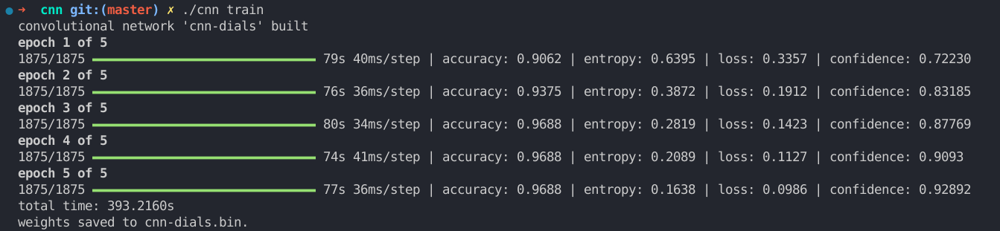

# CNN Implementation From Scratch

This repository contains a complete implementation of a Convolutional Neural Network (CNN) built from the ground up in C++. The project demonstrates deep understanding of neural network fundamentals through manual implementation of forward propagation, backpropagation, and gradient descent algorithms.

### Training Process


### Testing Results


The following sample images can be used to test the network:


## Mathematical Foundation

### Gradient Computation via Chain Rule

The chain rule enables computation of gradients for composite functions. For a function `L = f(g(h(x)))`, the gradient with respect to `x` is:

```
dL/dx = dL/df * df/dg * dg/dh * dh/dx
```

In neural networks, our objective is to minimize the loss function across all layers using the following key gradients:

```
dL/dw = dL/dz • x.T     // Gradient w.r.t. weights
dL/dx = w.T • dL/dz(l+1) // Gradient w.r.t. inputs (error propagation)
dL/dz = dL/da * f'(z)   // Error signal computation
dL/da = dL/dz(l+1) • w(l+1) // Loss w.r.t. activations
```

### Weight Update Mechanism

Weights are updated using gradient descent:
```
W(new) = W(old) - η • dL/dw
```
where `η` represents the learning rate. This constitutes the core optimization step that drives convergence.

### Backpropagation Implementation

Two approaches are implemented for error propagation:

**Method 1: Delta-based computation**
```
δ(l) = δ(l+1) • w(l+1).T
e = δ * f'(z(l))
```

**Method 2: Direct error signal computation**
```
e = w(l+1).T • e(l+1) * f'(z(l))
```

The second method eliminates intermediate steps and directly computes the backpropagated error, offering computational efficiency.
## Network Architecture

### Forward Propagation
For each layer `l` from 0 to `n-1`, the forward pass computes:

**Pre-activation:**
```
z = x • w + b
```

**Post-activation:**
```
a = f(z)
```

Where `f()` represents the activation function (ReLU, Sigmoid, Tanh, etc.). Note that for successive layers, `x = a(l-1)`, establishing the feed-forward data flow.

### Backward Propagation
The backpropagation algorithm proceeds from the output layer backwards, computing:

**Error Signal:**
```
dL/dz = dL/da * f'(z)
```

**Gradient Computation:**
```
dL/dw = dL/dz • x.T
```

**Weight Updates:**
The implementation supports various regularization techniques (L1, L2) and optimization algorithms (Adam) before applying the final weight update:
```
w(new) = w(old) - η * dL/dw
```

## Usage

```bash
# Training
./cnn train [architecture_file] [output_file]

# Testing
./cnn test [config_file]

# Image inference
./cnn <image_path> [config_file]
```

## Key Findings and Observations

1. **Bias Toward Specific Classes**: The network exhibits preference for digits 3 and 8 under uncertainty. This behavior likely stems from either class imbalance in the training dataset or stronger feature activations associated with these digits' geometric properties.

2. **Abstract Shape Recognition**: Simple geometric shapes can trigger high-confidence predictions due to selective neuron activation patterns. For instance:
   - Black dots frequently activate pathways associated with digit 9
   - Triangular shapes tend to activate digit 4 classification pathways

These observations highlight the importance of understanding learned feature representations and their relationship to network decision-making processes.

*Note: This project is continuously in progress and more notes and observations as well as updates will be added.*

## References

- [Introduction to Convolutional Neural Networks](https://arxiv.org/pdf/1511.08458)
